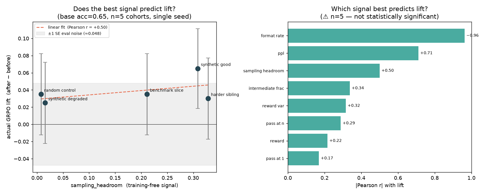

# Which cheap signal predicts how much a model gains from GRPO?

> **Inference-Time Compute Hackathon — Applied AI track.**
> Can a *training-free*, near-zero-cost metric tell you, **before** you spend a
> single GPU-hour on RL, how much a dataset will actually improve your model?

We take one small model (`Qwen2.5-1.5B-Instruct`), build five GSM8K **cohorts**
of deliberately varying quality, score each cohort with a basket of cheap
signals, then actually run GRPO on every cohort and measure the real accuracy
lift. The cohort is the *only* variable — everything else (config, eval set,
seed) is held fixed — so any difference in lift is attributable to the data.



> **Left:** each cohort's cheapest training-free signal (`sampling_headroom`) vs the
> GRPO lift we actually measured — a weak positive trend (r = +0.50), but every point's
> error bar overlaps the grey eval-noise band. **Right:** every signal ranked by its
> correlation with lift. The n=5 "winner" (`format_rate`, −0.96) has no mechanism behind
> it — a textbook small-sample spurious correlation, which is why we read this chart with
> caution rather than crowning a metric.

---

## TL;DR — the honest result

We got a **clean positive** and an **honest negative**, and the gap between them
is the most interesting finding.

| | Finding | Strength |
|---|---|---|
| ✅ | **Cheap signals are near-perfect data-quality detectors.** `reward_mean` and `pass@1` from a handful of sampled rollouts separate good cohorts (0.40–0.73) from corrupt ones (~0.00) with **zero ambiguity** — at a tiny fraction of the cost of training. | Strong |
| ⚠️ | **They do *not* reliably predict lift *magnitude*** in this run. With a single seed and n=200 eval, the spread in lift (0.025–0.065) is **smaller than the eval noise band** (±1 SE ≈ 0.048). | Inconclusive (underpowered) |
| 💡 | **The "failed" anchors explain the mechanism.** Corrupt cohorts (`reward_mean ≈ 0`) didn't *hurt* the model — they did nothing. Zero reward ⇒ zero GRPO advantage ⇒ near-identity update ⇒ checkpoint ≈ base. So `reward_mean` predicts **whether learning happens at all**, even when it can't rank the winners. | Strong & mechanistic |

The takeaway for a practitioner: **use the cheap reward signal as a go/no-go gate
on a dataset, not as a fine-grained lift forecaster.** It will catch a poisoned
or mismatched dataset for almost free; ranking two *good* datasets needs more eval
budget than a hackathon affords.

---

## The question (and why it's hard)

RL post-training (GRPO/PPO-style) is expensive and the payoff is uncertain. The
brief asks: **what task- and dataset-level metrics correlate with post-RL gain,
and where do they sit on the cost–quality frontier?** Judges care about the
*rationale* more than the exact numbers.

The trap is that the dependent variable — "lift" — is **noisy and small** for a
1.5B model on a fixed eval slice. That makes the experimental design (headroom,
size-matching, controls) matter more than any single metric.

---

## Experimental design

### Model & benchmark — chosen for *headroom*, not strength

Picking the model was itself a result (see [NOTES.md](NOTES.md)):

| Candidate | Base GSM8K | Verdict |
|---|---|---|
| `Qwen2.5-Math-1.5B` (base) | ~0.20 | ❌ Can't follow a zero-shot prompt — rambles past the answer, never boxes, no EOS. Flat reward curve. |
| `Qwen2.5-Math-1.5B-Instruct` | **0.855** | ❌ **Null-result ceiling** — no headroom for good cohorts to gain, and it never emits the wrong gold so corrupt cohorts never fire the reward. Every cohort ≈ 0 lift. |
| **`Qwen2.5-1.5B-Instruct`** (general) | **0.65** | ✅ Headroom in both directions — good cohorts *can* gain, the reward *can* fire on corruption. Lift has room to vary. |

`MODEL_ID` is centralized in [`math_common.py`](math_common.py) so one edit
re-points training, eval, and signals together.

### Five cohorts — same size, deliberate quality spread

Each cohort is **256 tasks** sharing one schema; only the data source/quality
changes. Degraded + control cohorts are designed to *anchor the low-lift end*.

| Cohort | Source | Intended quality |
|---|---|---|
| `benchmark_slice` | GSM8K train, random sample | High, in-distribution |
| `harder_sibling` | Top-30% hardest GSM8K by step count | Medium-high, harder |
| `synthetic_good` | Orca-Math word problems | Variable synthetic |
| `synthetic_degraded` | GSM8K with **wrong** answers injected | Low (bad supervision) |
| `random_control` | GSM8K with Q/A **mismatched** | Near-zero (control) |
| `eval_slice` *(held out)* | GSM8K **test**, fixed seed | Frozen eval set for every run |

Built by [`slice_cohorts_math.py`](slice_cohorts_math.py); corruptions by
[`make_synthetic_math.py`](make_synthetic_math.py).

### Pipeline

```
Phase 0  build cohorts            slice_cohorts_math.py   → cohorts/*.jsonl
Phase 1  score signals (GPU)      extract_signals_math.py → results/math_signals.jsonl
Phase 2  GRPO each cohort (GPU)   grpo_math.py  + eval_math.py → results/math_eval.jsonl
Phase 3  join & analyze (CPU)     analyze.py → results/math_joined.jsonl + report/results.png
```

GRPO config is **identical** across cohorts (constant LR 2e-6, 250 steps, 4
generations/prompt, seed 0). Driver: [`run_phase2.sh`](run_phase2.sh)
(fail-fast: base → one cohort → signals → the rest).

---

## The signals

All are computed from a small batch of sampled rollouts per task and aggregated
per cohort. Costs are *relative* — the point is they're all far cheaper than a
GRPO run.

| Signal | What it measures | Cost |
|---|---|---|
| `reward_mean` | Mean verifier reward over rollouts (≈ pass rate) | ~free (reuses rollouts) |
| `reward_var` | Variance of reward — proxy for *learnability* / intermediate difficulty | ~free |
| `pass@1` | Greedy correctness | low |
| `pass@N` | Any-of-N correctness | low |
| `sampling_headroom` | pass@N − pass@1 — gap RL could close | low |
| `self_consistency_gap` | Majority-vote vs greedy agreement | low |
| `ppl_mean` | Prompt perplexity under the model | medium |
| `format_rate` | Fraction emitting a parseable boxed answer | ~free |
| `intermediate_frac` | Fraction of tasks with pass-rate near 0.5 | ~free |

Defined domain-agnostically in [`signals.py`](signals.py) — the same definitions
are intended to port to the code track, which is what makes a cross-domain
comparison valid.

---

## Results

### Per-cohort numbers

Base accuracy **0.650** (n=200). Single seed. Eval SE ≈ 0.034 per point, so the
SE on a *lift* (difference of two proportions) is ≈ **0.048**.

| Cohort | acc after | **lift** | reward_mean | pass@1 | pass@N | ppl |
|---|---|---|---|---|---|---|
| `synthetic_good` | 0.715 | **+0.065** | 0.402 | 0.379 | 0.688 | 15.5 |
| `benchmark_slice` | 0.685 | +0.035 | 0.724 | 0.731 | 0.941 | 12.6 |
| `random_control` | 0.685 | +0.035 | **0.002** | 0.000 | 0.008 | 12.2 |
| `harder_sibling` | 0.680 | +0.030 | 0.530 | 0.559 | 0.887 | 8.6 |
| `synthetic_degraded` | 0.675 | +0.025 | **0.007** | 0.008 | 0.023 | 12.8 |

### Signal → lift correlation (n = 5 cohorts)

| Signal | Pearson r vs lift |
|---|---|
| `ppl_mean` | +0.71 |
| `sampling_headroom_mean` | +0.50 |
| `reward_var_mean` | +0.32 |
| `reward_mean_mean` | +0.22 |
| `pass_at_1_mean` | +0.17 |

⚠️ **Read these with a grain of salt: n = 5.** No correlation here is
statistically meaningful, and the lift spread is inside the noise band. We report
them for transparency, not as a ranking we'd defend.

---

## Key insights

1. **Design beats metrics.** The single biggest lever on getting *any* usable
   signal was model choice (headroom), not which cheap metric we computed. Two of
   our three model candidates produced a guaranteed null result before a metric
   was ever measured.

2. **Cheap signals nail data *quality*, not lift *magnitude*.** `reward_mean`
   splits good (0.40–0.73) from corrupt (≈0.00) cohorts with no overlap. That's a
   genuinely useful, almost-free dataset gate — it would have caught the poisoned
   and mismatched datasets instantly.

3. **Why corrupt data didn't hurt — the mechanism.** GRPO's update is driven by
   *advantage* (reward relative to the group). When every rollout for a corrupt
   task scores ~0, the advantage is ~0, the gradient is ~0, and the checkpoint
   stays ≈ base. So control/degraded cohorts landed at *base ± noise* rather than
   below it. This is why `reward_mean` is best understood as a **go/no-go gate**
   ("will this data move the model at all?") rather than a lift dial.

4. **The experiment is underpowered, and we say so.** Lift differences of 0.01–0.04
   on a single n=200 seed are not resolvable. The honest scientific output is:
   *the predictor side is strong; the dependent-variable side needs more budget.*

---

## What I'd do next (and what to do with the checkpoints)

The bottleneck is **eval noise on the dependent variable**, not the signals. In
priority order, with the GPU still up:

1. **Cheapest, highest value — re-eval existing checkpoints at larger n.** The
   trained checkpoints already exist; only inference is needed. Re-running each at
   `--n 500` (or the full 256-task `eval_slice` plus the test split) roughly halves
   the lift SE and is the single fastest way to tell whether `synthetic_good`'s
   +0.065 is real. No retraining.
2. **Add seeds 1 and 2 to training** and average the lifts — directly attacks
   run-to-run variance. More expensive (full GRPO runs), do only if budget allows.
3. **Preserve the checkpoints before killing the box.** Push the five
   `outputs/math_<cohort>_seed0` dirs to the HF Hub (or download them) so the
   re-eval in (1) can happen later without re-training. They're the expensive
   artifact in this whole project.
4. **Port `signals.py` to the code track** for the cross-domain validation the
   shared schema was built for.

> 💡 **Before you `stop` the instance:** if you can spare ~10–20 min of GPU,
> run step 1 (re-eval at higher n) and push the updated `results/math_eval.jsonl`.
> If not, at minimum do step 3 so the checkpoints survive. Everything in Phase 3
> is offline and already in this repo.

---

## Reproduce

```bash
pip install -r requirements.txt

# Phase 0 — build cohorts (CPU)
python slice_cohorts_math.py

# Phase 1 — signals (GPU)
python extract_signals_math.py

# Phase 2 — train + eval each cohort (GPU, in tmux)
python eval_math.py --model Qwen/Qwen2.5-1.5B-Instruct --label base --n 200
for C in benchmark_slice harder_sibling synthetic_good synthetic_degraded random_control; do
  python grpo_math.py --cohort $C --max_steps 250 --seed 0
  python eval_math.py --model outputs/math_${C}_seed0 --label $C --n 200
done

# Phase 3 — join + figure (CPU, offline)
python analyze.py
```

## Repo layout

| Path | Role |
|---|---|
| [`math_common.py`](math_common.py) | Central `MODEL_ID`, prompt, answer extraction |
| [`slice_cohorts_math.py`](slice_cohorts_math.py) | Phase 0 — build cohorts |
| [`make_synthetic_math.py`](make_synthetic_math.py) | Corruption helpers (wrong / mismatched) |
| [`signals.py`](signals.py) | Domain-agnostic signal definitions (shared contract) |
| [`extract_signals_math.py`](extract_signals_math.py) | Phase 1 — compute signals (GPU) |
| [`grpo_math.py`](grpo_math.py) | Phase 2 — GRPO training |
| [`eval_math.py`](eval_math.py) | Greedy-accuracy eval |
| [`analyze.py`](analyze.py) | Phase 3 — join signals×lift, render `report/results.png` |
| `cohorts/` | Cohort data + per-task signals |
| `results/` | `math_signals.jsonl`, `math_eval.jsonl`, `math_joined.jsonl` |
| `report/` | `results.png` + standalone `index.html` |
| [`PROBLEM.md`](PROBLEM.md) · [`GAMEPLAN.md`](GAMEPLAN.md) · [`NOTES.md`](NOTES.md) | Brief, strategy, lab notebook |

---

*Single 1.5B model, 5 cohorts × 256 tasks, GRPO @ 250 steps, n=200 eval, one seed.
Run on a Prime Intellect A100. The numbers are small and we are upfront about their
error bars — the contribution is the design and the mechanism, not a leaderboard.*
