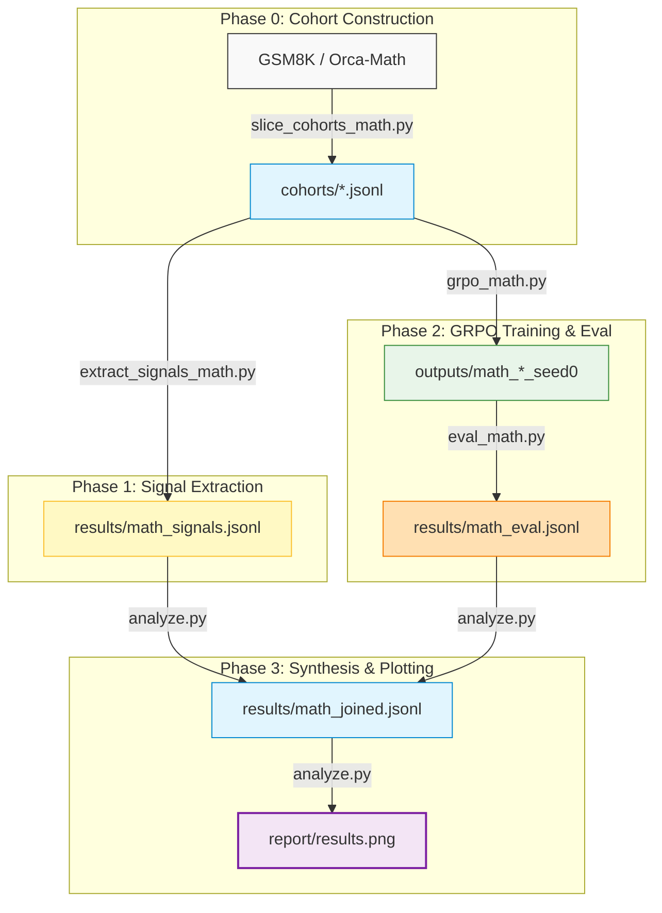

# Which Cheap Signal Predicts How Much a Model Gains from GRPO?

> [!NOTE]
> **Inference-Time Compute Hackathon — Applied AI Track**
>
> Can a *training-free*, near-zero-cost metric tell us, **before** we spend a single GPU-hour on Reinforcement Learning (RL), how much a dataset will actually improve our model?

We took a small generalist model (`Qwen2.5-1.5B-Instruct`), constructed five GSM8K **cohorts** of deliberately varying quality, scored each cohort with a basket of cheap signals, and then ran GRPO on every cohort to measure the real evaluation accuracy lift. By holding every other variable (hyperparameters, evaluation slice, seed) strictly constant, any difference in lift is directly attributable to the cohort's data.


> **Left:** Each cohort's cheapest training-free signal (`sampling_headroom`) plotted against the actual GRPO lift measured. While there is a weak positive trend ($r = +0.50$), each cohort's error bar overlaps the evaluation noise band. **Right:** All signals ranked by their Pearson correlation with lift. The $N=5$ "winner" (`format_rate`, $r = -0.96$) is a spurious small-sample correlation with no mechanistic backing, which underscores the importance of interpreting these rankings with caution.

---

## TL;DR — Summary of Results

We established a **clean positive** and an **honest negative** result. The gap between them constitutes our most actionable finding.

| | Finding | Evidence & Strength |
|---|---|---|
| **✅ Positive** | **Cheap signals are near-perfect data-quality detectors.** `reward_mean` and `pass@1` from a handful of sampled rollouts separate good cohorts (0.40–0.73) from corrupt ones (~0.00) with **zero ambiguity** — at a tiny fraction of the cost of training. | **Strong** |
| **⚠️ Negative** | **Signals do *not* reliably predict lift *magnitude*** in this regime. With a single seed and $N=200$ eval, the spread in lift (0.025–0.065) is **smaller than the evaluation noise band** ($\pm 1 \text{ SE} \approx 0.048$). | **Inconclusive** (underpowered) |
| **💡 Insight** | **The "failed" anchors explain the mechanism.** Corrupt cohorts (`reward_mean` $\approx 0$) did not actively damage the model—they did nothing. Zero reward $\implies$ zero GRPO advantage $\implies$ near-identity gradients $\implies$ final model $\approx$ base model. Thus, `reward_mean` acts as a **go/no-go gate**, even if it cannot rank high-quality cohorts. | **Strong & Mechanistic** |

> [!TIP]
> **Takeaway for Practitioners:** Use cheap reward signals as a **go/no-go gate** on a dataset rather than a fine-grained lift forecaster. It will successfully filter out poisoned or mismatched datasets for almost zero cost; ranking two high-quality datasets requires a significantly larger evaluation budget than is typical for rapid prototyping.

---

## Research Question & Motivation

Reinforcement Learning post-training (GRPO/PPO-style) is computationally expensive, and its payoff is highly sensitive to training data. The primary objective is to investigate: **what task- and dataset-level metrics correlate with post-RL gain, and where do they sit on the cost–quality frontier?** 

The primary challenge is that the dependent variable—accuracy "lift"—is **noisy and small** when evaluating a small model on a restricted evaluation slice. Therefore, experimental design (headroom selection, cohort controls, noise estimation) is critical to obtaining any scientifically valid conclusions.

---

## Experimental Design

### 1. Model & Benchmark Selection
Choosing the right base model was a key preliminary result (see [NOTES.md](NOTES.md)):

| Base Model Candidate | Base GSM8K Acc. | Verdict / Rationale |
|---|---|---|
| `Qwen2.5-Math-1.5B` (base) | ~0.20 | ❌ **Failed to follow prompt:** Zero-shot prompts led to rambling responses that failed to use boxed formats or emit proper EOS tokens, yielding a flat reward curve. |
| `Qwen2.5-Math-1.5B-Instruct` | 0.855 | ❌ **Null-result ceiling:** No headroom for high-quality cohorts to demonstrate lift, and it never emitted wrong answers on corrupt cohorts, meaning the verifier never fired. |
| **`Qwen2.5-1.5B-Instruct`** (general) | **0.650** | ✅ **Sufficient headroom:** Clear headroom in both directions. High-quality cohorts can improve, and corrupted cohorts trigger incorrect verifications, causing lift to vary. |

`MODEL_ID` is centralized in [`math_common.py`](math_common.py) so that modifying a single line re-points training, evaluation, and signal extraction.

### 2. Cohort Design
Each cohort consists of **256 tasks** sharing a single schema. Only the data source and quality vary, with degraded and control cohorts serving to anchor the low-lift range.

| Cohort | Source | Description / Intended Quality |
|---|---|---|
| `benchmark_slice` | GSM8K train | High-quality, in-distribution random sample. |
| `harder_sibling` | GSM8K train | Medium-high quality; top 30% hardest tasks by reasoning step count. |
| `synthetic_good` | Orca-Math | Variable-quality synthetic word problems. |
| `synthetic_degraded` | GSM8K train | Low quality; math problems with **wrong** answers injected. |
| `random_control` | GSM8K train | Near-zero quality; math problems with **mismatched** questions and answers. |
| `eval_slice` *(Held Out)* | GSM8K test | Frozen, deterministic evaluation set used for all runs. |

Cohorts were generated using [`slice_cohorts_math.py`](slice_cohorts_math.py), and synthetic corruptions were introduced via [`make_synthetic_math.py`](make_synthetic_math.py).

### 3. Experimental Pipeline



GRPO configurations were identical across all cohorts (LR $2 \times 10^{-6}$, 250 steps, 4 generations per prompt, seed 0). The pipeline driver [`run_phase2.sh`](run_phase2.sh) automates cohort generation, signal scoring, training, and evaluation.

---

## Cheap Predictor Signals

All signals are computed from a small batch of sampled rollouts per task and aggregated at the cohort level. The computational cost of these metrics is negligible compared to a full GRPO run.

| Signal | What it Measures | Cost |
|---|---|---|
| `reward_mean` | Mean verifier reward over rollouts (≈ pass rate) | Near-zero (reuses rollouts) |
| `reward_var` | Variance of reward (proxy for learnability/difficulty) | Near-zero (reuses rollouts) |
| `pass@1` | Greedy correctness rate | Low |
| `pass@N` | Any-of-N correctness rate | Low |
| `sampling_headroom` | $pass@N - pass@1$ (potential RL optimization margin) | Low |
| `self_consistency_gap` | Agreement rate between majority-vote and greedy decoding | Low |
| `ppl_mean` | Average prompt perplexity under the model | Medium |
| `format_rate` | Fraction of responses emitting a parseable `\boxed{}` answer | Near-zero |
| `intermediate_frac` | Fraction of tasks with a pass rate near 0.5 | Near-zero |

These signals are defined domain-agnostically in [`signals.py`](signals.py), ensuring they can be ported to other tracks (e.g., code generation) for cross-domain validation.

---

## Detailed Results

### 1. Per-Cohort Metrics
*Base Model Accuracy:* **0.650** ($N=200$). Single seed. Evaluation $\text{SE} \approx 0.034$ per point, yielding a Standard Error on the lift (difference of two independent proportions) of $\approx \mathbf{0.048}$.

| Cohort | Eval Acc | **Lift** | `reward_mean` | `pass@1` | `pass@N` | Prompt `ppl` |
|---|---|---|---|---|---|---|
| `synthetic_good` | 0.715 | **+0.065** | 0.402 | 0.379 | 0.688 | 15.5 |
| `benchmark_slice` | 0.685 | **+0.035** | 0.724 | 0.731 | 0.941 | 12.6 |
| `random_control` | 0.685 | **+0.035** | 0.002 | 0.000 | 0.008 | 12.2 |
| `harder_sibling` | 0.680 | **+0.030** | 0.530 | 0.559 | 0.887 | 8.6 |
| `synthetic_degraded` | 0.675 | **+0.025** | 0.007 | 0.008 | 0.023 | 12.8 |

### 2. Signal-to-Lift Correlation ($N=5$ Cohorts)

| Signal | Pearson Correlation ($r$) vs. Lift |
|---|---|
| `ppl_mean` | +0.71 |
| `sampling_headroom_mean` | +0.50 |
| `reward_var_mean` | +0.32 |
| `reward_mean_mean` | +0.22 |
| `pass_at_1_mean` | +0.17 |

> [!WARNING]
> **Spurious Correlation & Small Sample Size Warning**
>
> With only $N=5$ cohorts, no individual correlation is statistically significant, and the entire range of observed lifts falls within the evaluation noise band. While `format_rate` mathematically shows a high negative correlation ($r = -0.96$), there is no causal mechanism behind it. We report these correlations for completeness, not as a robust ranking of predictor strength.

---

## Key Insights

1. **Experimental Design > Metrics:** The most critical lever in obtaining a meaningful signal was base model selection. Selecting a model with sufficient headroom (avoiding the performance floor/ceiling) was far more important than the specific choice of cheap metric.
2. **Quality vs. Magnitude:** Cheap rollouts successfully detect dataset quality (separating clean cohorts from corrupted ones with zero overlap), but they cannot rank the performance of clean datasets when the evaluation is underpowered.
3. **The GRPO Gradient Attenuation Mechanism:** Why did corrupted/mismatched data not degrade the model below the base baseline? GRPO updates are driven by group relative advantage. When all generated rollouts for a task receive zero reward, the advantage scores are zero, generating near-zero gradients. Thus, corrupted data results in an identity update (checkpoint $\approx$ base) rather than active harm.
4. **Transparency in Reporting:** Lift differences of 1–4% on a single $N=200$ seed are not statistically resolvable. We explicitly highlight that while our predictor extraction is robust, resolving fine-grained dataset quality requires scaling the evaluation budget.

---

## Future Directions & Next Steps

The primary constraint in this study is the **evaluation noise of the dependent variable (accuracy lift)**. To build a more robust predictive model, future work should prioritize:

1. **Expanding Evaluation Sample Size ($N$):** Evaluating the checkpoints with a higher sample size (e.g., $N=500$ or the full GSM8K test split) to halve the evaluation Standard Error and confirm if the $+0.065$ lift of `synthetic_good` is statistically significant.
2. **Multi-Seed Runs:** Running GRPO across multiple random seeds and averaging their post-RL accuracy lifts to isolate algorithmic improvement from run-to-run variance.
3. **Model Checkpoint Hub:** Uploading the trained cohort checkpoints (`outputs/math_<cohort>_seed0`) to a shared model hub (e.g., Hugging Face) to enable scaled offline evaluations without redundant GPU re-training.
4. **Cross-Domain Portability:** Testing the domain-agnostic predictors in [`signals.py`](signals.py) on code generation tasks to assess their predictive power across diverse modalities.

---

## Replication Guide

```bash
# Install dependencies
pip install -r requirements.txt

# Phase 0 — Build Cohorts (CPU)
python slice_cohorts_math.py

# Phase 1 — Signal Scoring (GPU)
python extract_signals_math.py

# Phase 2 — GRPO Training & Evaluation (GPU)
# Baseline Eval:
python eval_math.py --model Qwen/Qwen2.5-1.5B-Instruct --label base --n 200

# Train and Eval Cohorts:
for C in benchmark_slice harder_sibling synthetic_good synthetic_degraded random_control; do
  python grpo_math.py --cohort $C --max_steps 250 --seed 0
  python eval_math.py --model outputs/math_${C}_seed0 --label $C --n 200
done

# Phase 3 — Synthesis & Rendering (CPU, Offline)
python analyze.py
```

---

## Repository Structure

| Path | Description |
|---|---|
| [`math_common.py`](math_common.py) | Centralized configurations (e.g., `MODEL_ID`), prompt templates, and extraction helpers. |
| [`slice_cohorts_math.py`](slice_cohorts_math.py) | Phase 0 — Construction of the five training cohorts. |
| [`make_synthetic_math.py`](make_synthetic_math.py) | Helpers for injecting wrong answers and mismatched question-answer pairs. |
| [`signals.py`](signals.py) | Domain-agnostic definition of predictor metrics (shared contract). |
| [`extract_signals_math.py`](extract_signals_math.py) | Phase 1 — Computing predictor signals for each cohort. |
| [`grpo_math.py`](grpo_math.py) | Phase 2 — GRPO training loop. |
| [`eval_math.py`](eval_math.py) | Phase 2 — Greedy deterministic accuracy evaluation. |
| [`analyze.py`](analyze.py) | Phase 3 — Synthesis of signals and lift, rendering `report/results.png`. |
| `cohorts/` | Directory containing generated cohort JSONL files and their raw signal scores. |
| `results/` | Output directory containing `math_signals.jsonl`, `math_eval.jsonl`, and `math_joined.jsonl`. |
| `report/` | Output directory for `results.png` and the interactive `index.html` dashboard. |
| [`PROBLEM.md`](PROBLEM.md) · [`GAMEPLAN.md`](GAMEPLAN.md) · [`NOTES.md`](NOTES.md) | The hackathon prompt, implementation roadmap, and developer lab notebook. |

---
*Results are based on a single seed run of Qwen2.5-1.5B-Instruct on 5 cohorts of 256 tasks each, trained via GRPO for 250 steps, and evaluated on a deterministic 200-task test slice on a Prime Intellect A100 instance. We emphasize physical mechanism design and transparency over leaderboard metrics.*
